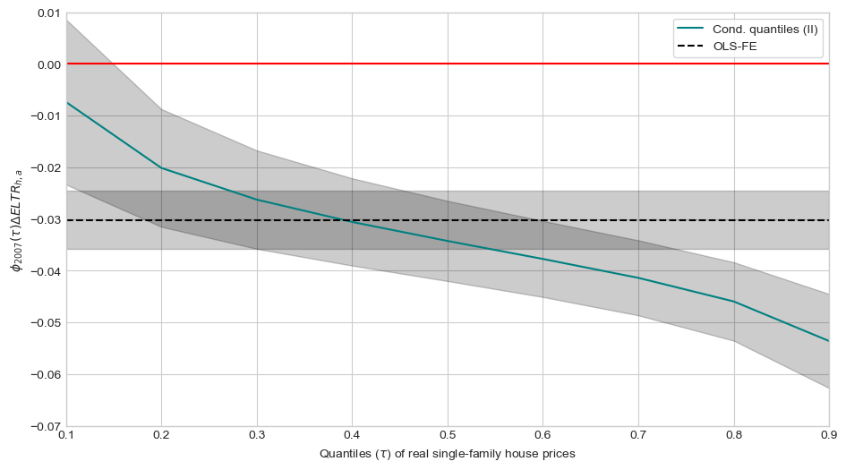

# No taxation without capitalization

A seminar paper in public economics by Jørgen Baun Høst, University of Copenhagen. In this paper, I exploit quasi-experimental evidence from a 2007 reform that substantially changed land value taxation ('grundskyldspromille') in Denmark to see its effect on house prices. I use quantile regression on webscraped data from [boliga.dk](https://www.boliga.dk/) and find evidence of capitalization effects, which is higher at the top of the market segment than it is at the bottom.

The project is structured as follows:

- ``1_scraper.ipynb`` - scraper used in webscraping [boliga.dk](https://www.boliga.dk/), which draws on work by Lassen and Høst [(2022)](https://github.com/jorgenhost/Liar_liar_pants_on_fire). NB! Uses multithreading to speed up webscraping process. Be nice to [boliga.dk](https://www.boliga.dk/) and do not overload their servers - scrape data at odd hours and/or adjust the number of ``max_workers`` accordingly.
- ``2_bbr_merge.py`` & ``2_clean_bbr.ipynb`` - a ``.py`` script used in the notebook to clean the extensive BBR (The Danish Building and Dwelling Register) dataset. 
- ``3_kommune_shp.ipynb`` - processes shapefiles to be used with GPS-coordinates in house sale data.
- ``4_main.ipynb`` - used for data and econometric analysis along with ``4_qreg.do``. 

## To-do
- ``1_scraper.ipynb`` - when scraping the BBR, the scraper saves each API-call to the disk (one house per call). Perhaps adjust so it saves in 'batches' of like 2000 houses?