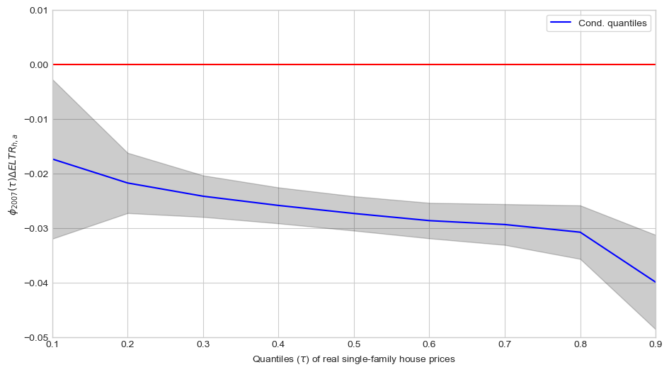

# No taxation without capitalization

A seminar paper in public economics by Jørgen Baun Høst, University of Copenhagen. In this paper, I exploit quasi-experimental evidence from a 2007 reform that substantially changed land value taxation in Denmark to see its effect on house prices. I use quantile regression on webscraped data from [boliga.dk](https://www.boliga.dk/) and find evidence of capitalization effects, which is higher at the top of the market segment than it is at the bottom.

